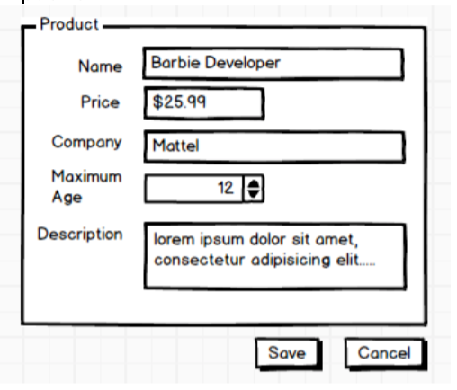
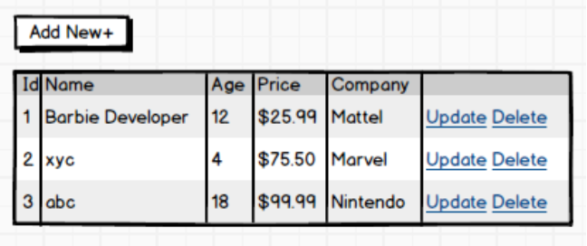

# Web Stock Management <!-- omit in toc -->
This project is meant to create a stock management web tool for toys and games

- [Requirements](#requirements)
  - [UI Mockups](#ui-mockups)
- [Architecture](#architecture)

# Requirements

Create a stock management web tool for “Toys and Games” store.

- [ ] Should be able to list the available products in a grid
- [ ] Should be able to Create, Update, Delete products
- [ ] Should provide a simple Form when creating or updating products
- [ ] Should provide user confirmation for product Deletion
- [ ] **(OPTIONAL)** display product images

### **Table design** <!-- omit in toc -->

Name | Type | Optional | Constrains
---- | ---- | -------- | ----------
**Id** | int | No | Unique
**Name** | string | No | Max length 50
**Description** | string | Yes | Max length 100
**AgeRestriction** | int | Yes | 0 to 100
**Company** | string | No | Max length 50
**Price** | decimal | No | 1$ to $1000

## UI Mockups

* Data form

* Data table

# Architecture

**Data Persistence**
1. Use simple file storage (EF In memory database, JSON, Redis, etc)
2. Implement IRepository pattern
3. Use Code First
4. (OPTIONAL) Use seed data

**Server Side**
1. Use ASP.NET Core 3.1
2. Model/Entity validation
3. Use Dependency Injection
4. Add a Unit test project with at least 5 unit tests using either xUnit, MSTest
5. (OPTIONAL) Use mocking framework

**(OPTIONAL) Client Side**
1. Use framework Angular 6 or Above
2. Use simple CSS or a CSS framework like
3. Bootstrap to provide a simple UI experience
4. Input form validation
5. (OPTIONAL) Use granular components
6. (OPTIONAL) Use SASS or LESS
7. (OPTIONAL) Use responsive design
8.  (OPTIONAL) Add JS unit test